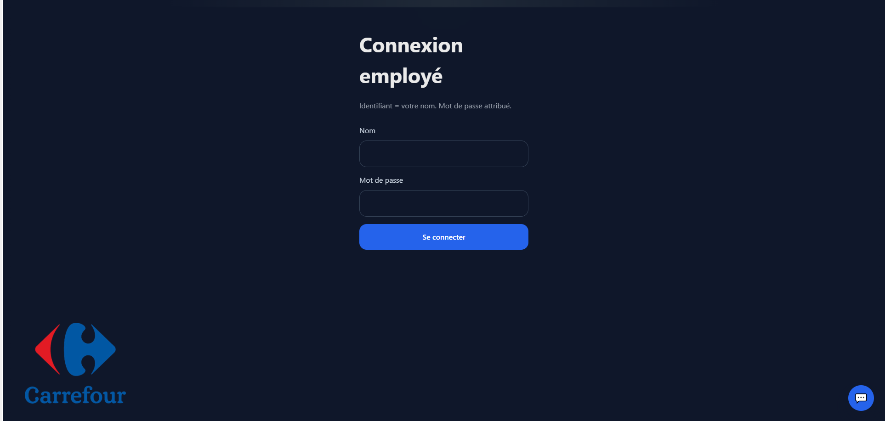
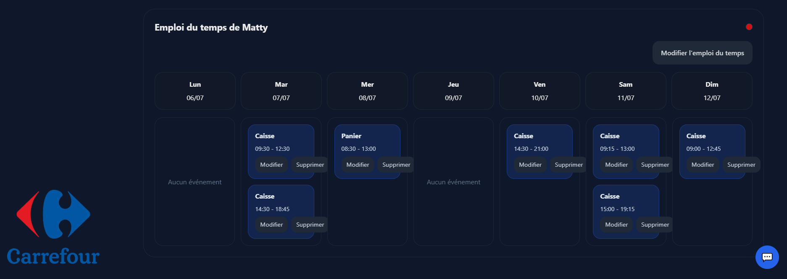
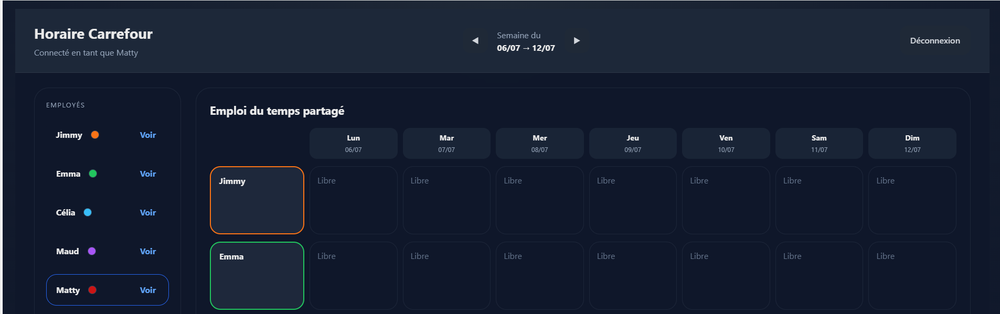
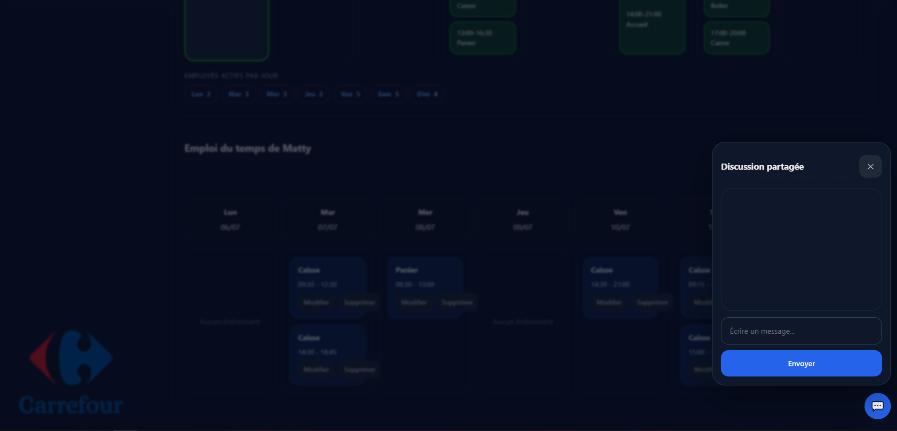

# Horaire Carrefour

Application web (PWA) de planning partagé pour une équipe d'employés Carrefour : chacun consulte et modifie son emploi du temps hebdomadaire, visualise les horaires de l'équipe en un coup d'œil, et discute via un chat intégré. Installable sur mobile et notifie les employés par push.

## Aperçu

| Connexion | Emploi du temps personnel |
|---|---|
|  |  |

| Vue partagée | Chat |
|---|---|
|  |  |

## Fonctionnalités

- **Connexion par employé** : identifiant = prénom, mot de passe attribué individuellement.
- **Emploi du temps hebdomadaire** : navigation semaine par semaine, édition des créneaux personnels.
- **Vue partagée** : grille commune montrant les horaires de toute l'équipe et les chevauchements.
- **Chat en temps réel** entre employés.
- **Notifications push** (Web Push / VAPID) lors des mises à jour.
- **PWA installable** avec fonctionnement hors-ligne via un service worker (cache "network-first").
- **Synchronisation en temps réel** via Supabase Realtime (plannings et messages).

## Stack technique

- HTML / CSS / JavaScript vanilla (aucun framework, aucun build).
- [Supabase](https://supabase.com/) : base de données (tables `events`, `messages`, `push_subscriptions`) et souscriptions realtime.
- Service worker (`sw.js`) pour le cache applicatif et la réception des notifications push.

## Structure du projet

```
index.html         Structure de l'application (écran de connexion + écran principal)
styles.css          Styles de l'application
script.js           Logique applicative (auth, planning, chat, realtime, push)
sw.js                Service worker (cache offline, notifications push)
manifest.json        Manifeste PWA
icon-*.png           Icônes de l'application
logoCarrefour.png     Logo affiché dans l'interface
```

## Configuration

L'application se connecte à un projet Supabase via les constantes définies en tête de `script.js` :

```js
const SUPABASE_URL = '...';
const SUPABASE_KEY = '...';       // clé publique (anon/publishable)
const VAPID_PUBLIC_KEY = '...';   // clé publique VAPID pour les notifications push
```

La clé privée VAPID associée (nécessaire côté serveur pour envoyer les notifications) n'est **pas** versionnée dans ce dépôt et doit rester secrète.

Le schéma Supabase attendu comprend les tables :
- `events` : créneaux d'emploi du temps (`week_key`, `user_id`, horaires...)
- `messages` : messages du chat
- `push_subscriptions` : abonnements aux notifications push des employés

## Lancer le projet en local

Aucune dépendance ni build : servir le dossier avec n'importe quel serveur statique, par exemple :

```bash
npx serve .
```

Puis ouvrir l'URL indiquée dans le navigateur.
