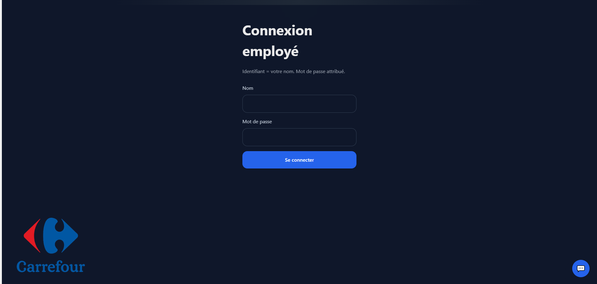
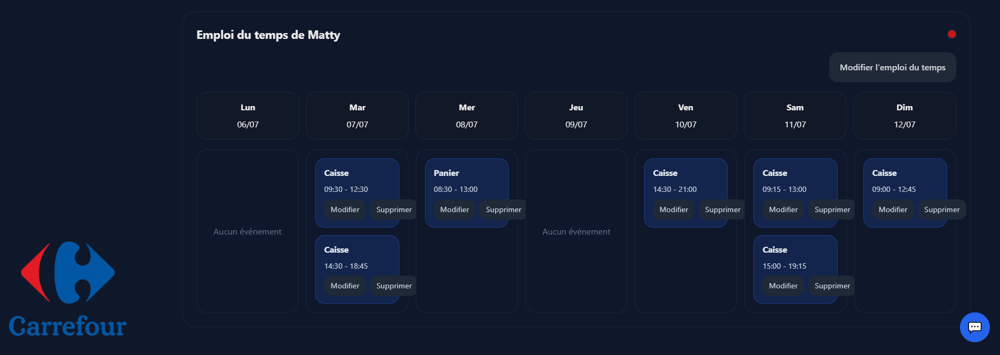
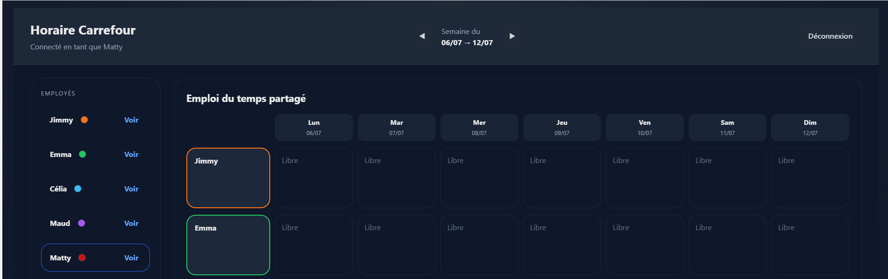
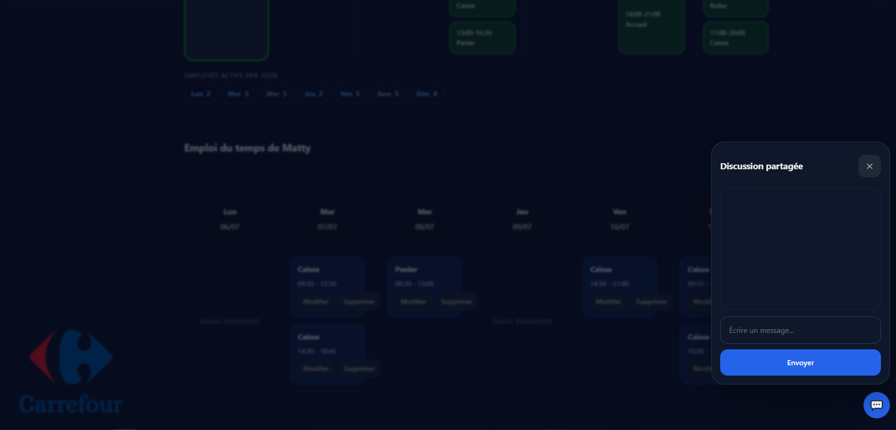

# Horaire Carrefour

Application web (PWA) de planning partagé pour une équipe d'employés : chacun consulte et modifie son emploi du temps hebdomadaire, partage ses horaires au sein de groupes, et échange via un chat intégré. Installable sur mobile avec notifications push.

## Aperçu

| Connexion | Emploi du temps personnel |
|---|---|
|  |  |

| Vue partagée | Chat |
|---|---|
|  |  |

## Fonctionnalités

### Authentification
- **Inscription avec code équipe** : prénom + mot de passe + code fourni oralement par l'admin.
- **Validation admin obligatoire** : chaque compte est approuvé (ou refusé) avant tout accès.
- **Bascule automatique** : l'écran d'attente se met à jour tout seul dès que le compte est validé.

### Planning
- **Emploi du temps hebdomadaire** : navigation semaine par semaine, ajout et modification de créneaux personnels.
- **Import photo OCR** : prends en photo le ticket papier du planning — l'app le lit avec Tesseract.js, corrige les erreurs courantes et propose une vérification avant import.
- **Synchronisation en temps réel** via Supabase Realtime.

### Groupes (façon WhatsApp)
- Créer un groupe, demander à rejoindre, ou inviter directement un collègue.
- Chaque groupe dispose d'un **chat en temps réel** et d'une **vue planning partagée** de ses membres.
- La visibilité des horaires est **liée aux groupes** : rejoindre un groupe partage automatiquement son planning avec ses membres.

### Messages directs
- Envoyer une demande de contact à n'importe quel collègue.
- Une fois acceptée : **chat 1-à-1** avec partage optionnel de son planning (toggle individuel, pas automatique).

### Administration
- Panneau admin intégré : accepter ou refuser les demandes de compte en attente.
- Badge de notification sur les nouvelles demandes en temps réel.

### PWA & notifications
- **Installable sur mobile** via le manifeste PWA.
- **Notifications push** (Web Push / VAPID) lors des mises à jour.
- **Service worker** avec cache versionné (network-first).

## Stack technique

- HTML / CSS / JavaScript vanilla (aucun framework, aucun build).
- [Supabase](https://supabase.com/) : authentification, base de données et Realtime.
- [Tesseract.js](https://tesseract.projectnaptha.com/) : OCR côté navigateur pour l'import photo.
- Service worker (`sw.js`) pour le cache applicatif et les notifications push.

## Structure du projet

```
index.html              Structure de l'application
styles.css              Styles principaux
styles-auth.css         Styles de l'écran de connexion/inscription
script.js               Logique applicative complète
sw.js                   Service worker (cache offline, notifications push)
manifest.json           Manifeste PWA
icon-*.png              Icônes de l'application
```

## Schéma Supabase

| Table | Rôle |
|---|---|
| `profiles` | Comptes employés et rôles (statut : en_attente / approuve / refuse) |
| `events` | Créneaux d'emploi du temps (`week_key`, `user_id`, horaires…) |
| `push_subscriptions` | Abonnements aux notifications push |
| `groupes` | Groupes d'équipe |
| `groupe_membres` | Appartenance aux groupes (membre / demande / invitation) |
| `groupe_messages` | Messages des chats de groupe |
| `conversations` | Demandes et conversations 1-à-1 |
| `conversation_messages` | Messages des conversations directes |
| `conversation_partage` | Partage optionnel du planning dans un DM |

## Configuration

Les constantes en tête de `script.js` :

```js
const SUPABASE_URL = '...';
const SUPABASE_KEY = '...';       // clé publique (anon/publishable)
const VAPID_PUBLIC_KEY = '...';   // clé publique VAPID pour les notifications push
const CODE_EQUIPE = '...';        // code d'inscription communiqué oralement aux collègues
```

La clé privée VAPID (côté serveur) n'est **pas** versionnée dans ce dépôt et doit rester secrète.

## Lancer en local

Aucune dépendance ni build : servir le dossier avec n'importe quel serveur statique :

```bash
npx serve .
```

Puis ouvrir l'URL indiquée dans le navigateur.
